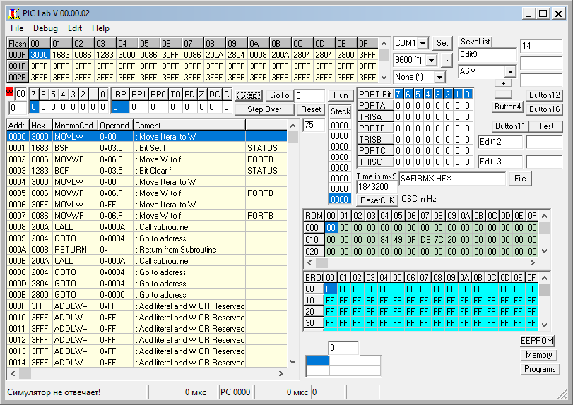

# PICLab debuger for PIC16F876 (Microchip)
PIC simulation debugger

 

The PICLab program wrote on Delphi 6.0, the compiled program and the sources included.
> Программа PICLab написана на Delphi 6.0, скомпилированная программа и исходники прилагаются.

 

The program runs code from HEX file
>Программа выполняет код из HEX файла.

Screen:

 

### Bried descriptions / Краткое описание
The program, during the start, searches the serial port for a stitched debugging assistant, and if it does not find it, it switches to the full simulation mode by issuing a warning. This project was launched as an attempt to debug the main peripheral modules, since the Microchip debugger was slow and buggy. Unfortunately, further
the continuation of the program was difficult in time.
Sources will be useful for familiarization with the principles of writing debuggers. At one time, it was very helpful in mastering the microcontroller.
The folder contains examples of laed.HEX led.HEX SAFIRMX.HEX ss1.HEX code and PICLAB.HEX code stitched into the PIC16F876 microcontroller and a connection to the microcontroller via the microcontroller's serial port.
>Программа во время старта ищет на последовательном порту прошитый помошник отладчика, и если не находит его, то переходит в режим полной симуляции выдав предупреждение. Этот проект был начат, как попытка отладить основные перефирийные модули, так как отладчик от Microchip был медленным и сильно глючил. К сожалению, дальнейшее
продолжение программы было сложным по времени. 
Исходники будут полезны для ознакомления с принципами написания отладчиков. В своё время очень выручила при освоении микроконтроллера.
В папке присутствуют примеры кода laed.HEX led.HEX SAFIRMX.HEX ss1.HEX и код PICLAB.HEX зашиваемый в микроконтроллер PIC16F876 а связь с микроконтроллером через последовательный порт микроконтроллера.

 

### Usage / Использование

* **File** - меню работы с файлами.
  * ***Open HEX Ctrl-O*** - Открыть HEX файл и загрузит в память симулятора
  * ***Save HEX Ctrl-S*** - заглушка(не работает)
  * ***Save Listing Ctrl-L*** - заглушка(не работает)
  * ***Exit Ctrl-X*** - Выход из программы

* **Debug** -  Функции отладки/трассировки программы
  * ***Step F7*** - Выполнить команду с заходом в подпрограммы
  * ***Step Over F8*** - Выполнить программы проходя через подпрограммы в фоне
  * ***Reset F2*** - Сбросить симулятор в начальное состояние
  * ***Go to F5*** - заглушка(не работает)
  * ***Run F9*** - запуск выполнения программы до первой ошибки
  * ***Set BP*** - Установить точку останова
  * ***Del BP*** - Снять точку останова
